## 👥 Autores

- [ KAUA MACHADO DA SILVA](https://github.com/KauaMach)
- [ALAN NUNES VELOSO NOGUEIRA ](https://github.com/alannunes73) 
- [MATHEUS KAIKY BRITO SILVA  ](https://github.com/matheuskaiky) 
---
# Projeto: Envelope Digital com Criptografia RSA + AES

Este projeto é uma aplicação para criação e abertura de envelopes digitais, combinando criptografia RSA e AES com diferentes modos e for
---

## 📁 Estrutura do Projeto

```bash
Envelope_Digital/
│
├── 📂 assets/               # Recursos não-código
│   ├── 📂 images/           # Capturas de tela e imagens da interface
│   └── 📂 diagrams/         # Diagramas de arquitetura e fluxo
│
├── 📂 src/                  # Código-fonte principal
│   ├── 📜 utils.py          # Utilitários: padding PKCS7, codificação Base64Hex          
│   ├── 🔐 rsa_manager.py    # Gera e carrega chaves RSA (1024/2048 bits)
│   ├── 🔒 aes_manager.py    # Implementa AES (128/192/256 bits) nos modos ECB/CBC
│   ├── ✉️ envelope.py       # Combina RSA+AES para criar/abrir envelopes digitais
│   ├── 🚀 app.py            # Ponto de entrada do aplicativo 
│   └── 🔌 main.py
├── 
├── 📜 requirements.txt      # Dependências: cryptography, tkinter, etc.
├── 📜 README.md             # Documentação completa
│
├── 📂 teste/                # Arquivos gerados automaticamente
│   ├── 🔑 chaves_rsa/       # Armazena chaves públicas/privadas (.pem)
│   ├── 📄 mensagens/        # Mensagens criptografadas/descriptografadas
│   └── 🔐 chaves_aes/       # Chaves AES criptografadas

``` 


---
## 🚀 Funcionalidades

- 🔐 **Geração de chaves RSA** (1024 ou 2048 bits) para criptografia assimétrica.
- ✉️ **Criação de envelope digital** utilizando criptografia híbrida (RSA para a chave AES e AES para a mensagem).
- 📂 **Abertura de envelope digital**, permitindo a descriptografia da mensagem e da chave AES utilizando a chave privada RSA.
- 🧾 **Codificação em Base64 ou Hexadecimal** para facilitar a leitura e escrita dos arquivos criptografados.
- 🔄 **Modos de operação AES**:
  - **ECB** (Electronic Codebook) para operações sem IV.
  - **CBC** (Cipher Block Chaining) com **IV** (vetor de inicialização) para maior segurança na criptografia.
- 🖥️ **Interface gráfica (GUI)** utilizando Tkinter, com funcionalidades de rolagem para visualizar o conteúdo de arquivos criptografados e descriptografados.
- 📁 **Armazenamento automático** dos arquivos de chave, mensagem criptografada e IV (se necessário) em uma pasta **`teste/`**, para facilitar o gerenciamento de dados durante os testes.

---
## 🛠️ Instalação e Configuração do Ambiente


1. **Instale e selecione a versão do Python**

    → **Versão do Python utilizada:** 3.13.3

2. **Instale as dependências necessárias:**

    ```bash
    pip install -r requirements.txt
    ```

    → Instale todas as dependências do projeto listadas no arquivo `requirements.txt`.

---
## ▶️ Como Usar

1. 💻 **Inicie o aplicativo:**

    Abra o terminal e execute o seguinte comando para iniciar a interface gráfica:

    ```bash
    python3 src/app.py #Windows python src/app.py
    ```

    Isso iniciará o aplicativo e abrirá a interface gráfica, permitindo que você utilize todas as funcionalidades.

    ---
2.  🧩 **Recursos da Interface**
    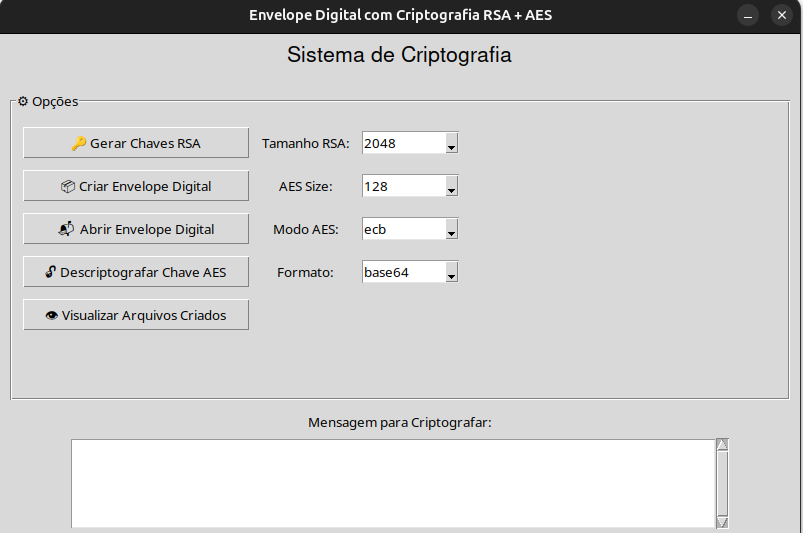

    A interface gráfica permite interagir com as principais funcionalidades do aplicativo. Alguns recursos incluem:


    - **Geração de Chaves RSA:** 
        - Selecione o tamanho da chave (1024 ou 2048 bits) para criar um par de chaves RSA (pública e privada).
    
    - **Criação de Envelope Digital:**
        - Insira uma mensagem para criptografá-la utilizando a criptografia híbrida (RSA + AES).
        - A chave AES será gerada e criptografada com a chave pública RSA.

    - **Abertura de Envelope Digital:**
        - Selecione um arquivo de envelope digital criptografado.
        - Descriptografe a chave AES com a chave privada RSA e depois a mensagem criptografada.

    - **Codificação Base64 ou Hexadecimal:**
        - Escolha o formato de codificação para visualizar a chave ou a mensagem criptografada.

    - **Modos de Operação AES:**
        - Selecione entre os modos de operação ECB ou CBC (com IV) para a criptografia AES.

    - **Exibição de Arquivos:**
        - A interface possui uma área de rolagem para permitir a visualização dos arquivos Gerados

    Esses recursos são acessíveis diretamente na interface, facilitando o uso das funcionalidades do aplicativo.
--- 
## 📖 Exemplos Práticos

### 🔑 Exemplo 1: Gerar Chaves RSA
**Objetivo**: Criar um par de chaves pública/privada para criptografia assimétrica.
```bash
Escolha: 🔑 Gerar Chaves RSA
Tamanho da chave RSA: (1024/2048): 2048
Digite o nome da chave pública: public.pem
Digite o nome da chave privada: private.pem

📂 Arquivos gerados:
teste/
├── public.pem    # Chave pública (compartilhável)
└── private.pem   # Chave privada (sigilosa)
```

### ✉️ Exemplo 2: Criar Envelope Digital
```bash
Caixa Digite a Mensagem: ''Dados confidenciais 123@!''
Tamanho AES: 256
Modo: cbc
Formato: hexadecimal
Escolha: 📦 Criar Envelope Digital
Chave pública: public.pem
Digite o nome Arquivo chave cifrada: encrypted_key
Digite o nome Arquivo mensagem cifrada: encrypted_msg
Digite o nome Arquivo IV: iv

📂 Arquivos gerados:

teste/
├── encrypted_key.txt 
├── encrypted_msg.txt  
└── iv.txt   
```
### 🔓 Exemplo 3: Abrir Envelope Digital
```bash
Modo: cbc
Formato: hexadecimal
Escolha: 📬  Abrir Envelope Digital
Mensagem cifrada: encrypted_msg
Arquivo Chave cifrada: encrypted_key
Arquivo Chave privada: private.pem
Arquivo IV: iv.b64
Digite o nome Arquivo Saída: decrypted.txt

📂 Arquivos gerados:

teste/ 
└── idecrypted.txt

```
### 🔓 Exemplo 4: Descriptografar Chave AES
```bash
Escolha: 🔓 Descriptografar Chave AES
Arquivo Chave cifrada: encrypted_key
Arquivo Chave privada: private.pem

📂 Arquivos gerados:

teste/ 
└── aes_key_decifrada.txt
```
### 👁️Exemplo 5: Visualizar Arquivos Criados
```bash
Escolha: 👁️ Visualizar Arquivos Criados

📂 Saida:

└──  Visualização dos arquivos Gerados

```
---

## 🔄 Diagrama de Fluxo 
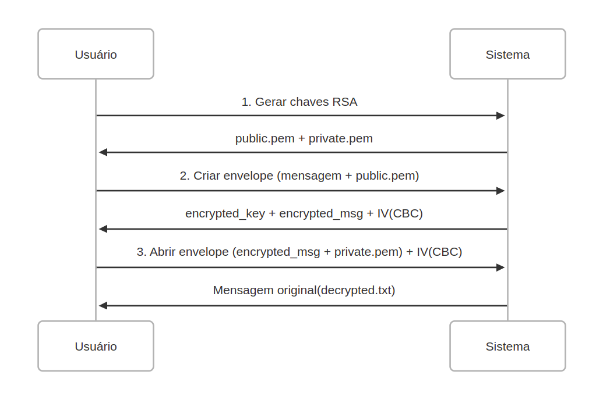

--- 

## 📸 Capturas de Tela

### 🔑 Geração de Chaves RSA

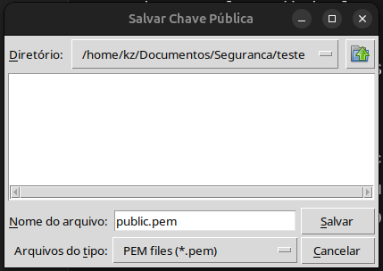
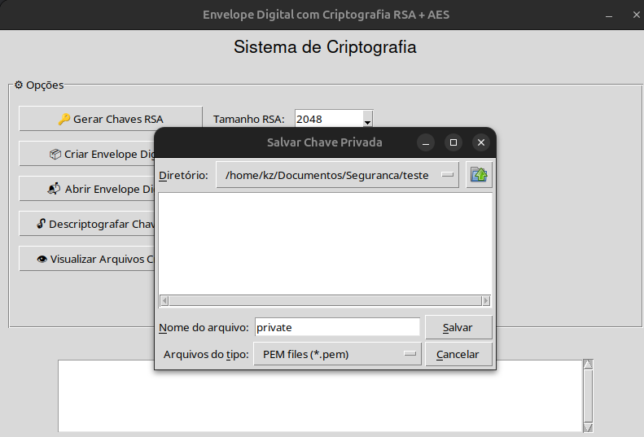
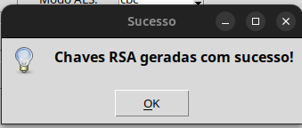

### ✉️ Criação de Envelope

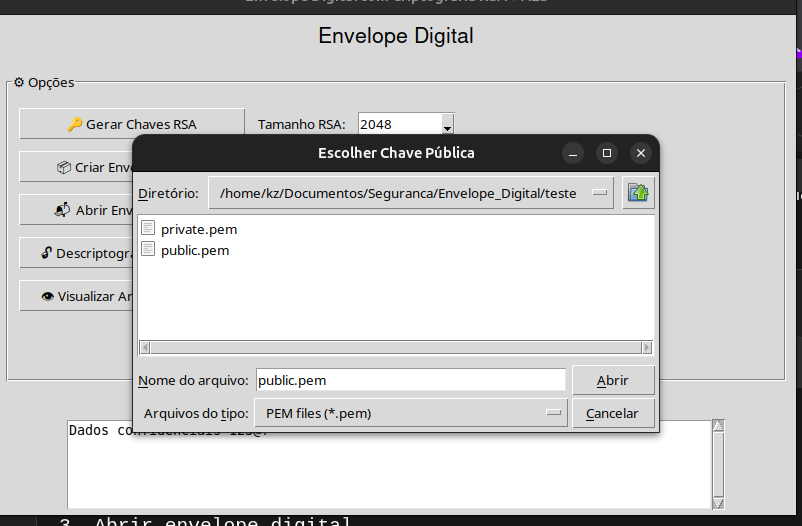
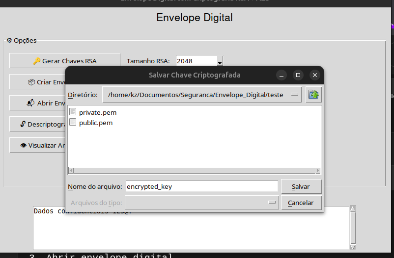

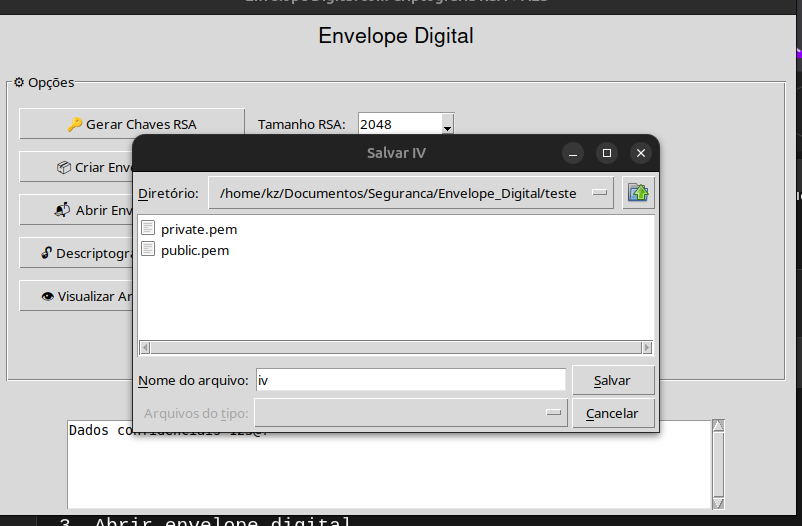

### 🔓 Abertura de Envelope
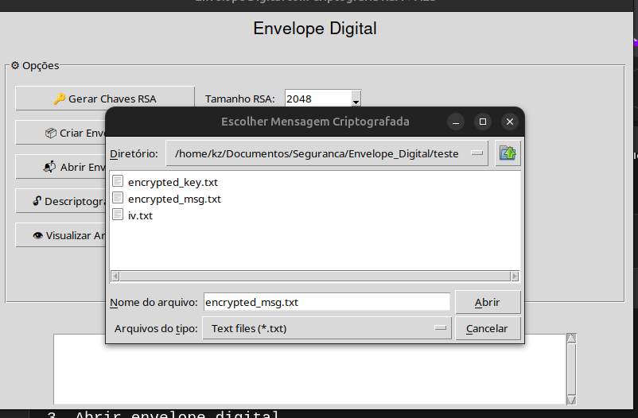

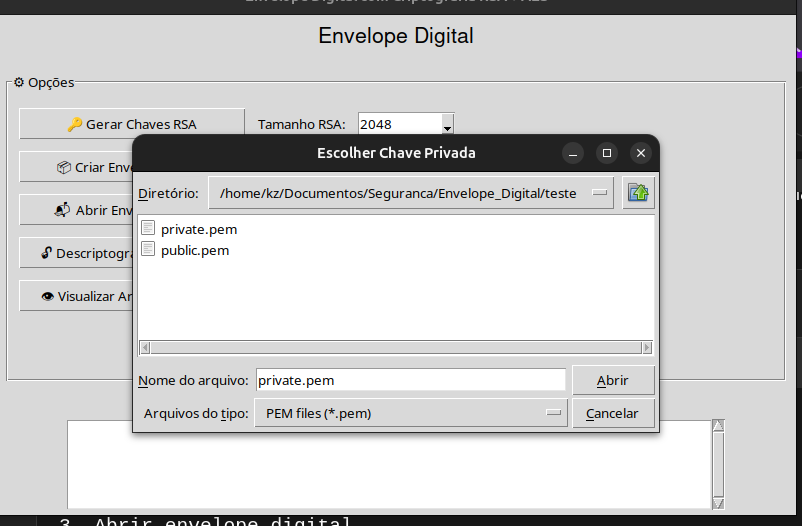
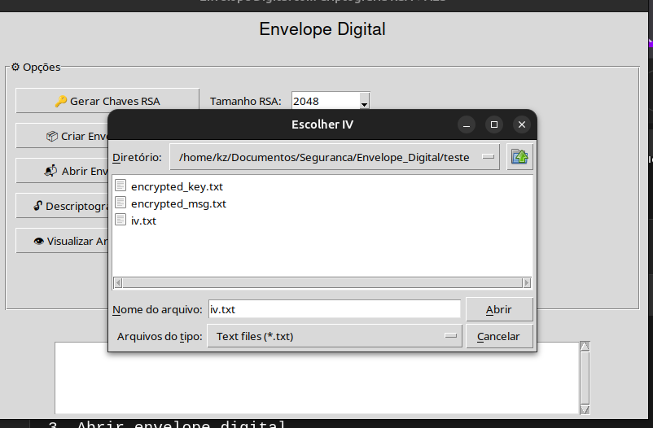
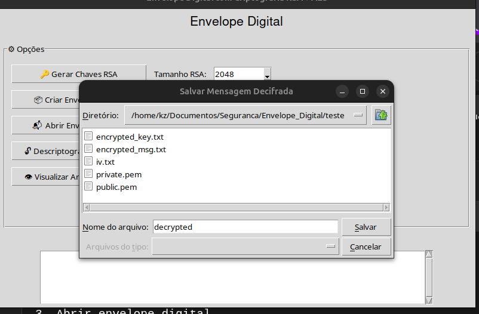
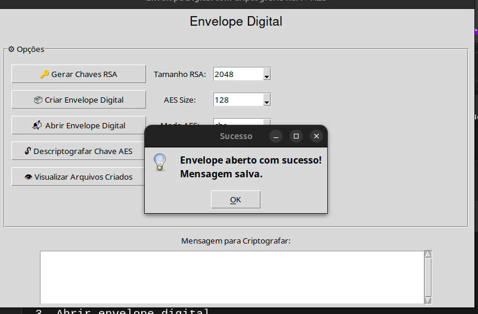

### 🔐 Descriptografia AES
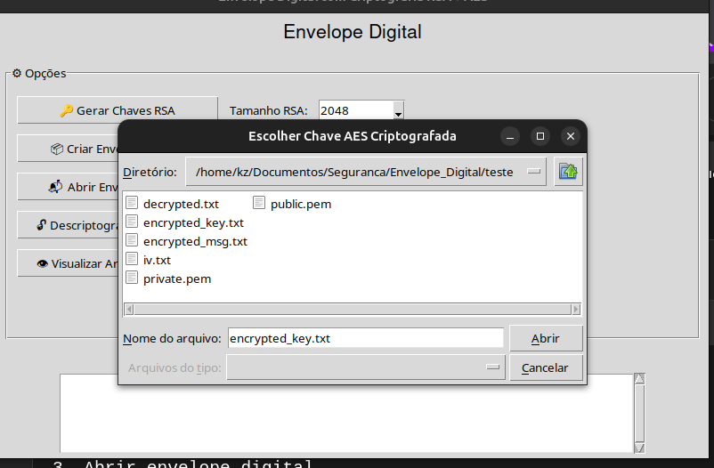
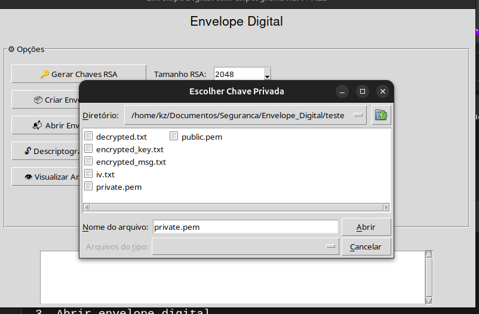
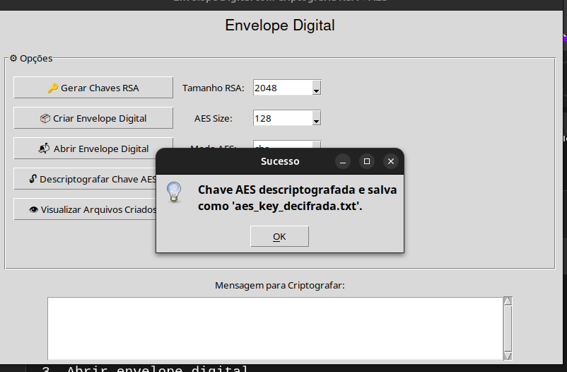

### 🖥️ Interface Principal


### 📊 Visualização
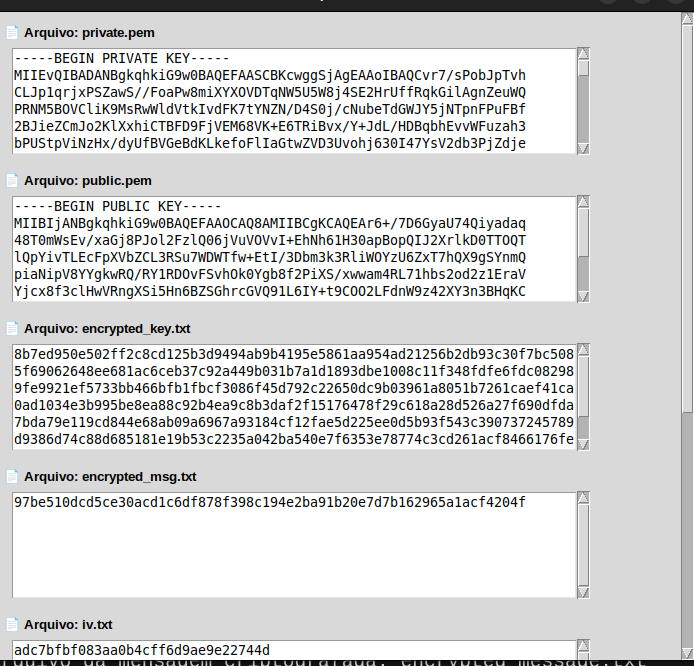
